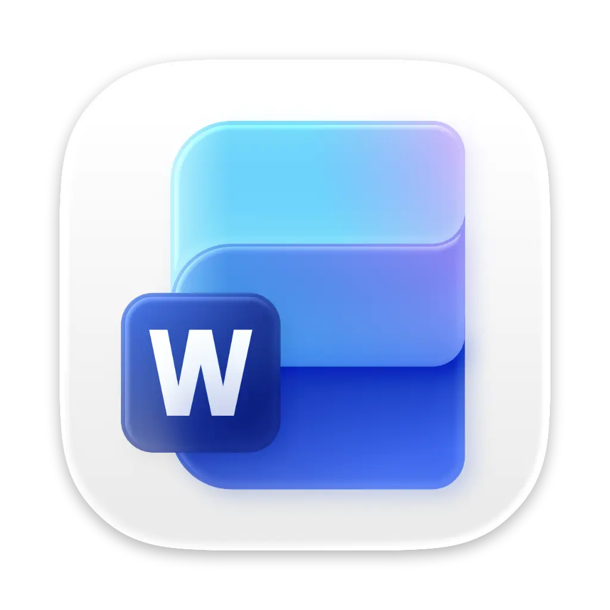
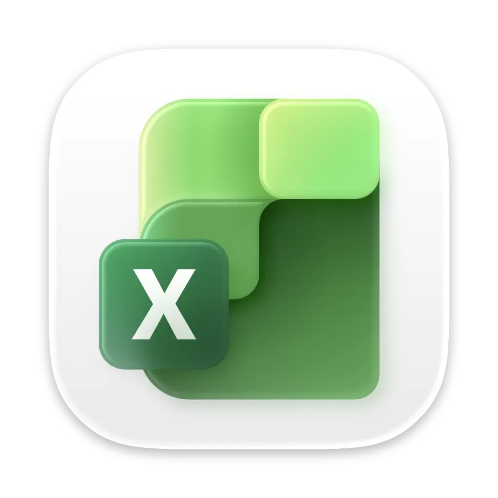
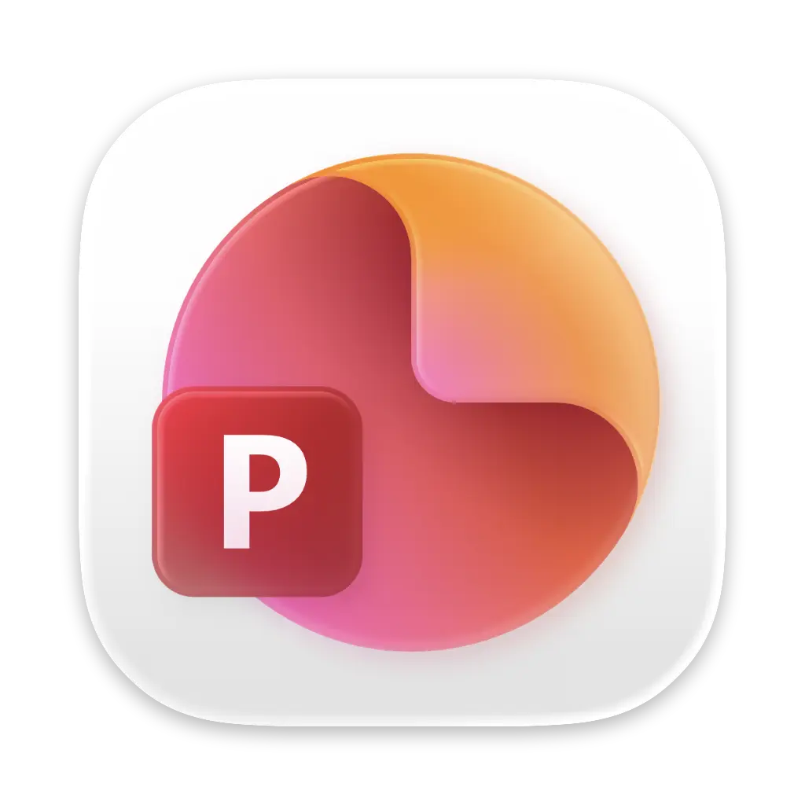
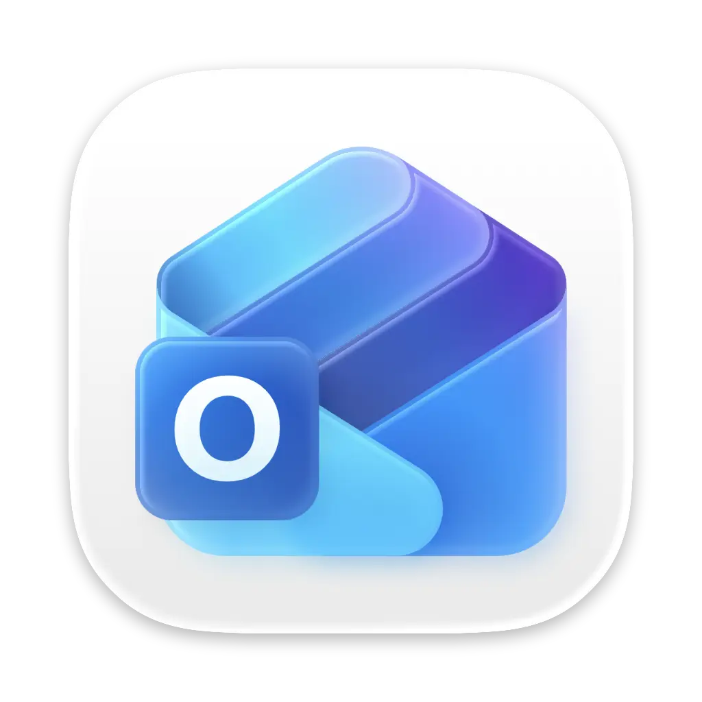
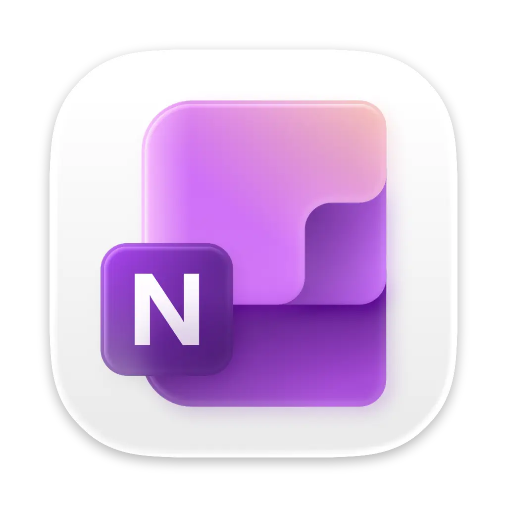
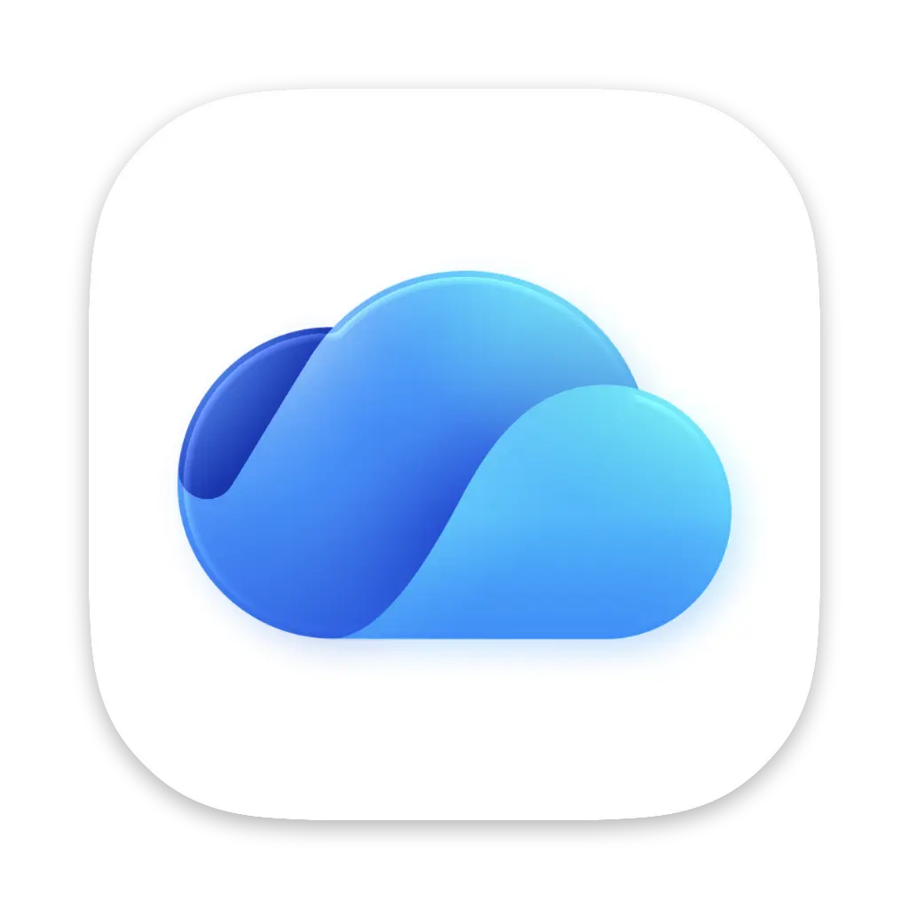
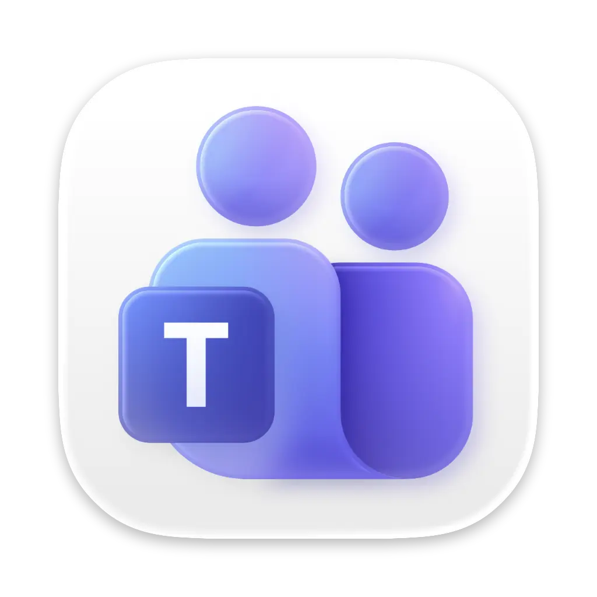
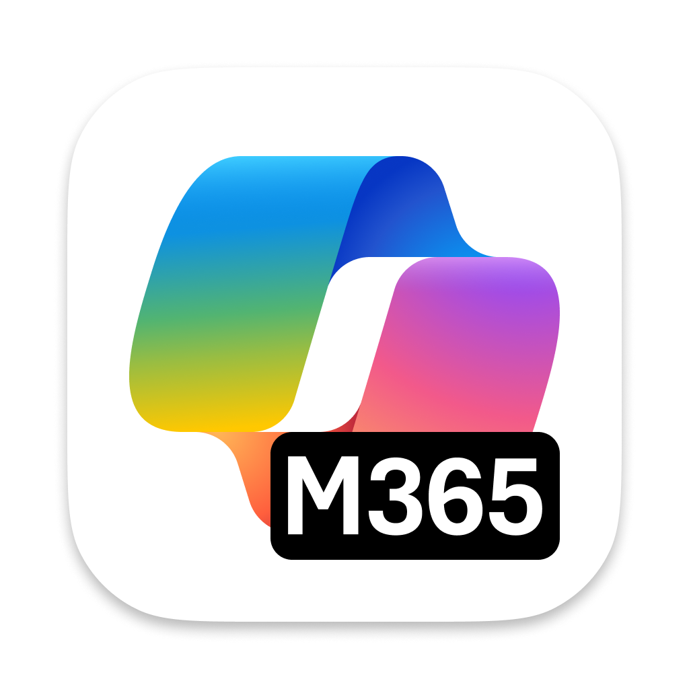

# **MOFA**
**M**icrosoft **O**verview **F**eed for **A**pple

Welcome to the **MOFA** repository! This resource offers Microsoft Office downloads for macOS, comprehensive data feeds for all iOS, Mac App Store, and other Microsoft apps, along with tools and documentation links to help Mac admins manage and repair Microsoft products on Apple platforms. Feeds are automatically updated from XML and JSON links directly from Microsoft.

Building on the legacy of the now-defunct [**MacAdmins.software**](https://macadmins.software), MOFA provides a comprehensive and up-to-date solution. Special thanks to [**Paul Bowden**](https://github.com/pbowden-msft) for his exceptional contributions to the Mac Admins community.

We welcome community contributions—fork the repository, ask questions, or share insights to help keep this resource accurate and useful for everyone. Check out the user-friendly website version below for an easier browsing experience!

<table>
  <tr>
    <th>🌟 Explore the MOFA Website 🌟</th>
    <th>⭐ Support the Project – Give it a Star! ⭐</th>
  </tr>
  <tr>
    <td align="center">🌐 <strong>Visit:</strong>  🌐</td>
    <td align="center">
      
    </td>
  </tr>
</table>

## </a> Microsoft Standalone Packages

All links below direct to Microsoft's official Content Delivery Network (CDN).
The links provided will always download the latest version offered by Microsoft. However, the version information listed below reflects the version available at the time of this update.

_Last Updated: <code style="color : mediumseagreen">July 15, 2026 10:45 AM EDT</code> [**_Raw XML_**](latest_raw_files/macos_standalone_latest.xml) [**_Raw YAML_**](latest_raw_files/macos_standalone_latest.yaml) [**_Raw JSON_**](latest_raw_files/macos_standalone_latest.json) (Automatically Updated every 1 hour)_

| **Product Package** | **Bundle Information** | **Download** |
|----------------------|----------------------|--------------|
| **Microsoft** 365/2021/2024 **Office Suite Installer** <a href="https://learn.microsoft.com/en-us/officeupdates/release-notes-office-for-mac" style="text-decoration: none;"><small>_Release Notes_</small></a> _(Includes Word, Excel, PowerPoint, Outlook, OneNote, OneDrive, Defender Shim, and MAU)_  _**Last Update:** `July 13, 2026`_  | **Version:** `16.111.0 (26071325)`  **Min OS:** `14.0`  **CFBundle ID:** `com.microsoft.office` |  |
| **Microsoft** 365/2021/2024 **BusinessPro Suite Installer** _(Includes Word, Excel, PowerPoint, Outlook, OneNote, OneDrive, Teams, Defender Shim, and MAU)_  _**Last Update:** `July 13, 2026`_  | **Version:** `16.111.0 (26071325)`  **Min OS:** `14.0`  **CFBundle ID:** `com.microsoft.office` |  |
| **Word** 365/2021/2024 **Standalone Installer**  _**Last Update:** `July 13, 2026`_  | **Version:** `16.111.0 (26071325)`  **Min OS:** `14.0`  **CFBundle ID:** `com.microsoft.word` |  |
| **Word** 365/2021/2024 **App Only Installer**  _(Does Not Contain MAU)_  _**Last Update:** `July 13, 2026`_  | **Version:** `16.111.0 (26071325)`  **Min OS:** `14.0`  **CFBundle ID:** `com.microsoft.word` |  |
| **Excel** 365/2021/2024 **Standalone Installer**  _**Last Update:** `July 13, 2026`_  | **Version:** `16.111.0 (26071325)`  **Min OS:** `14.0`  **CFBundle ID:** `com.microsoft.excel` |  |
| **Excel** 365/2021/2024 **App Only Installer**  _(Does Not Contain MAU)_  _**Last Update:** `July 13, 2026`_  | **Version:** `16.111.0 (26071325)`  **Min OS:** `14.0`  **CFBundle ID:** `com.microsoft.excel` |  |
| **PowerPoint** 365/2021/2024 **Standalone Installer**  _**Last Update:** `July 13, 2026`_  | **Version:** `16.111.0 (26071325)`  **Min OS:** `14.0`  **CFBundle ID:** `com.microsoft.powerpoint` |  |
| **PowerPoint** 365/2021/2024 **App Only Installer**  _(Does Not Contain MAU)_  _**Last Update:** `July 13, 2026`_  | **Version:** `16.111.0 (26071325)`  **Min OS:** `14.0`  **CFBundle ID:** `com.microsoft.powerpoint` |  |
| **Outlook** 365/2021/2024 **Standalone Installer**  _**Last Update:** `July 13, 2026`_  | **Version:** `16.111.0 (26071325)`  **Min OS:** `14.0`  **CFBundle ID:** `com.microsoft.outlook` | |
| **Outlook** 365/2021/2024 **App Only Installer**  _(Does Not Contain MAU)_  _**Last Update:** `July 13, 2026`_  | **Version:** `16.111.0 (26071325)`  **Min OS:** `14.0`  **CFBundle ID:** `com.microsoft.outlook` | |
| **OneNote** 365/2021/2024 **Standalone Installer**  _**Last Update:** `July 13, 2026`_  | **Version:** `16.111.0 (26071325)`  **Min OS:** `14.0`  **CFBundle ID:** `com.microsoft.onenote.mac` |  |
| **OneNote** 365/2021/2024 **App Only Installer**  _(Does Not Contain MAU)_  _**Last Update:** `July 13, 2026`_  | **Version:** `16.111.0 (26071325)`  **Min OS:** `14.0`  **CFBundle ID:** `com.microsoft.onenote.mac` |  |
| **OneDrive Standalone Installer** (Production Ring)  <a href="https://support.microsoft.com/en-us/office/onedrive-release-notes-845dcf18-f921-435e-bf28-4e24b95e5fc0#OSVersion=Mac" style="text-decoration: none;"><small>_Release Notes_</small></a>  _**Last Update:** `July 13, 2026 10:05 PM EDT`_  | **Version:** `26.119.0622`  **Min OS:** `NA`  **CFBundle ID:** `com.microsoft.OneDrive` |  |
| **Skype for Business Standalone Installer** <a href="https://support.microsoft.com/en-us/office/follow-the-latest-updates-in-skype-for-business-cece9f93-add1-4d93-9a38-56cc598e5781?ui=en-us&rs=en-us&ad=us" style="text-decoration: none;"><small>_Release Notes_</small></a>  _**Last Update:** `January 20, 2026`_  | **Version:** `16.31.0.31`  **Min OS:** `10.14.0`  **CFBundle ID:** `com.microsoft.SkypeForBusiness` |  |
| **Teams Standalone Installer** <a href="https://support.microsoft.com/en-us/office/what-s-new-in-microsoft-teams-d7092a6d-c896-424c-b362-a472d5f105de" style="text-decoration: none;"><small>_Release Notes_</small></a>  _**Last Update:** `June 23, 2026`_  | **Version:** `26163.407.4839.8659`  **Min OS:** `14.0`  **CFBundle ID:** `com.microsoft.teams2` |  |
| **InTune Company Portal Standalone Installer** <a href="https://aka.ms/intuneupdates" style="text-decoration: none;"><small>_Release Notes_</small></a>  _**Last Update:** `July 07, 2026`_  | **Version:** `5.2606.0`  **Min OS:** `11.0`  **CFBundle ID:** `com.microsoft.CompanyPortalMac` |  |
| **InTune Company Portal App Only Installer** <a href="https://aka.ms/intuneupdates" style="text-decoration: none;"><small>_Release Notes_</small></a> _(Does Not Contain MAU)_  _**Last Update:** `July 07, 2026`_  | **Version:** `5.2606.0`  **Min OS:** `11.0`  **CFBundle ID:** `com.microsoft.CompanyPortalMac` |  |
| **Edge** _(Current Channel)_ <a href="https://learn.microsoft.com/en-us/deployedge/microsoft-edge-relnote-stable-channel" style="text-decoration: none;"><small>_Release Notes_</small></a>  _**Last Update:** `July 11, 2026 05:31 AM EDT`_  | **Version:** `150.0.4078.65`  **Min OS:** `11.0`  **CFBundle ID:** `com.microsoft.edgemac` | |
| **Defender for Endpoint Installer** <a href="https://learn.microsoft.com/microsoft-365/security/defender-endpoint/mac-whatsnew" style="text-decoration: none;"><small>_Release Notes_</small></a>  _**Last Update:** `June 12, 2026`_  | **Version:** `101.26042.0020`  **Min OS:** `14.0`  **CFBundle ID:** `com.microsoft.wdav` |  |
| **Defender for Consumers Installer** <a href="https://learn.microsoft.com/microsoft-365/security/defender-endpoint/mac-whatsnew" style="text-decoration: none;"><small>_Release Notes_</small></a>  _**Last Update:** `June 12, 2026`_  | **Version:** `101.26042.0020`  **Min OS:** `14.0`  **CFBundle ID:** `com.microsoft.wdav` |  |
| **Defender SHIM Installer**  _**Last Update:** `May 08, 2026`_  | **Version:** `101.26030.0000`  **Min OS:** `12.0`  **CFBundle ID:** `com.microsoft.wdav.shim` |  |
| **Windows App Standalone Installer** _(Remote Desktop )_ <a href="https://learn.microsoft.com/en-us/windows-app/whats-new?tabs=macos" style="text-decoration: none;"><small>_Release Notes_</small></a>  _**Last Update:** `June 23, 2026`_  | **Version:** `11.3.7`  **Min OS:** `12.0`  **CFBundle ID:** `com.microsoft.rdc.macos` |  |
| **Windows App Only Installer** _(Remote Desktop )_ <a href="https://learn.microsoft.com/en-us/windows-app/whats-new?tabs=macos" style="text-decoration: none;"><small>_Release Notes_</small></a> _(Does Not Contain MAU)_  _**Last Update:** `June 23, 2026`_  | **Version:** `11.3.7`  **Min OS:** `12.0`  **CFBundle ID:** `com.microsoft.rdc.macos` |  |
| **Visual Studio Code Standalone Installer** <a href="https://code.visualstudio.com/updates/" style="text-decoration: none;"><small>_Release Notes_</small></a>  _**Last Update:** `July 14, 2026`_  | **Version:** `1.128.1`  **Min OS:** `N/A`  **CFBundle ID:** `com.microsoft.VSCode` | |
| **Microsoft Copilot** <a href="https://learn.microsoft.com/en-us/copilot/microsoft-365/release-notes?tabs=all" style="text-decoration: none;"><small>_Release Notes_</small></a>  _**Last Update:** `July 06, 2026`_  | **Version:** `1.2607 (0602)`  **Min OS:** `14.0`  **CFBundle ID:** `com.microsoft.m365copilot` | |
| **AutoUpdate Standalone Installer** <a href="https://learn.microsoft.com/en-us/officeupdates/release-history-microsoft-autoupdate" style="text-decoration: none;"><small>_Release Notes_</small></a>  _**Last Update:** `July 11, 2026`_  | **Version:** `4.84 (26071119)`  **Min OS:** `12.0`  **CFBundle ID:** `com.microsoft.autoupdate` | |
| **Licensing Helper Tool Installer**  _**Last Update:** `September 10, 2023`_  | **Version:** `16.77.0 (23091003)`  **Min OS:** `11.0`  **CFBundle ID:** `com.microsoft.licensinghelper` | |
| **Quick Assist Installer**  _**Last Update:** `October 09, 2025`_  | **Version:** `1.0.2510032`  **Min OS:** `12.0`  **CFBundle ID:** `com.microsoft.quickassist` | |
| **Remote Help Installer**  _**Last Update:** `June 03, 2026`_  | **Version:** `1.0.2606021`  **Min OS:** `12.0`  **CFBundle ID:** `com.microsoft.remotehelp` | |

### SHA256 Information Table

| **Product Package** | **Download** | **SHA256** |
|----------------------|-----------------|------------|
| **Microsoft Office Suite** |  | `9a150b1b66735bfeb23e2029a441a3f79db8fe3874d34dbc3ad9f2b92b00c1a4` |
| **Microsoft BusinessPro Suite** |  | `f7424f24ac14edd46bab2ff52285b8a2455ac2e9f98e3be73e9f46524f0999df` |
| **Word Standalone** |  | `4d42f7e1b6b602fdde777b0d424db68ad9b5d989d7240b6e57729cd7c08e61c9` |
| **Word App Only** |  | `bafb0bd7ea1bc90c4ab2582b109df8a599d97042263f649d07b3402943d096bf` |
| **Excel Standalone** |  | `6be3d53735855729637bcdb7af33aca54b099b322ed678b1abbc4ed65c675795` |
| **Excel App Only** |  | `9de9fbc08edd4674542702ec0ad395367265bff4a881bc67e998007a401c09c2` |
| **PowerPoint Standalone** |  | `a1de24f8b3dc05eced3707884392ea2455e4f1cfef9c7cd0e069381449920aaa` |
| **PowerPoint App Only** |  | `fcfeef48ac9c2c864a24b64893459dcb571b230446ad0ca2ebb09ce3c041f005` |
| **Outlook Standalone** |  | `4093ccb2e56f4be3a28d338aab56f5f2f034b2bd79396f44c10296b2769a472d` |
| **Outlook App Only** |  | `d0096db367b872506231c3cbbed4a6c6cbb58c13667c7ecca6981362f1d4a776` |
| **OneNote Standalone** |  | `e99f559bbd23db80d5890481a27b5b9572f0fa0a096e156e4aefe3e9005d74b1` |
| **OneNote App Only** |  | `dcc011a405e9a493f89678eb5398033c3108c9237a6c10b093a946608377c244` |
| **OneDrive** |  | `ed8037715552d25538207786b36503ead1be5d5c8cd457c4cabba67df7a11e35` |
| **Skype for Business** |  | `891dbba7518645642e6bfe4287071b984830994c528fad82490b4df6b14e4312` |
| **Teams** |  | `bcf6d54723446063e3b37c5a03bbd5c9f5f8e7bf5e7517d6db2676fc0e684e0b` |
| **Intune Company Portal Standalone** |  | `ff3f32c392fdd7eadb3c6b6c8d17c05c864716c387817f8731b241cbd1346197` |
| **Intune Company Portal App Only** |  | `8bdc0084c29bc5898b638be1b07feb4c5c714bb90ee9bc061df3d0b19d0e3d0c` |
| **Edge** |  | `68929c051651b056123369874fe5f6bea0a268500e6c506f6922b2d539a2fd86` |
| **Defender for Endpoint** |  | `79e5c96e08a2e48d7c11aa1bea8fdea1a44a5d8914296f4090d30e1927d44f22` |
| **Defender for Consumers** |  | `8d7a33f79ad00e8fdc2d75b1f826f7e75327c0c9cf72b0955d254ddb6b878b21` |
| **Defender SHIM** |  | `e306f0bd9cd2dcd7160fa415e2b19a883b0d9f65c551030be52fbdda72a1b90a` |
| **Windows App Standalone** |  | `e3a0e38b29de21868b3dd2c2d22f838a2e49df2908a26cbf61f34b52c42c4032` |
| **Windows App Only** |  | `162dbfa850feb558140a70e67f2e94461f00aa8cd4717c75ffc38666838a09f8` |
| **Visual Studio Code** |  | `6bb7b71393e1ae1f831add4e0e0a3d74675e70092f64d978d3ce37d6594be48a` |
| **Microsoft Copilot** |  | `19148ebe9846d3cc5871d808fe2568c3abab7901da24feb453be00b472e2f6ac` |
| **AutoUpdate** |  | `a307dc89adfd60c0f9d60ad869efd19e22798ec7fd11015a351378e0249325cd` |
| **Licensing Helper Tool** |  | `2ef5b5006534c0d20d46c7353f42a0dc1faff7d53ba89a3151ccf5102c059905` |
| **Quick Assist** |  | `294bed3d1cab280056ff20b22c65486381c976b10c1e4e2ae9559404484ec55a` |
| **Remote Help** |  | `686c9fe7b54ff006b574653abc2fe616afe9244d561d5bd9fd84a99971a8c423` |

_**For items without specific release notes, please refer to the release notes for the entire suite.**_  

_[**How to Get the SHA256 Guide**](/guides/How_To_SHA256.md)_

| **Last Supported MacOS** | **File Name** | **Version** | **Download** |
|---------------------------|----------------|-------------|--------------|
| macOS 13 Ventura  | Microsoft Office Suite Installer | `16.101` |  |
| macOS 13 Ventura  | Microsoft BusinessPro Suite Installer| `16.101` |  |
| macOS 12 Monterey  | Microsoft Office Suite Installer | `16.88` |  |
| macOS 12 Monterey  | Microsoft BusinessPro Suite Installer| `16.88` |  |
| macOS 11 Big Sur  | Microsoft Office Suite Installer | `16.77` |  |
| macOS 11 Big Sur  | Microsoft BusinessPro Suite Installer| `16.77` |  |
| macOS 10.15 Catalina  | Microsoft Office Suite Installer | `16.66` |  |
| macOS 10.15 Catalina  | Microsoft BusinessPro Suite Installer| `16.66` |  |

|      Update History                   |          Microsoft Update Channels               |
|-------------------------|-------------------------|
|  [Microsoft 365/2021/2024](https://learn.microsoft.com/en-us/officeupdates/update-history-office-for-mac) |   [Microsoft 365 Apps](https://learn.microsoft.com/en-us/microsoft-365-apps/updates/overview-update-channels) |

## </a> Microsoft Other Tools Packages

_Some of these tools are also available via [Homebrew](https://brew.sh); the versions below reflect the latest official Microsoft releases._

_Last Updated: <code style="color : mediumseagreen">July 15, 2026 10:46 AM EDT</code> [**_Raw XML_**](latest_raw_files/macos_other_latest.xml) [**_Raw YAML_**](latest_raw_files/macos_other_latest.yaml) [**_Raw JSON_**](latest_raw_files/macos_other_latest.json) (Automatically Updated every 4 hours)_

| **Product Package** | **Bundle Information** | **Download** |
|----------------------|----------------------|--------------|
| **PowerShell**  _**Last Update:** `June 16, 2026`_  | **Version:** `7.6.3` |  |
| **.NET SDK 10 (LTS)**  _**Last Update:** `July 14, 2026`_  | **Version:** `10.0.302` |  |
| **.NET SDK 11 (Preview)**  _**Last Update:** `July 14, 2026`_  | **Version:** `11.0.100-preview.6.26359.118` |  |
| **.NET SDK 9 (STS)**  _**Last Update:** `July 14, 2026`_  | **Version:** `9.0.316` |  |
| **.NET SDK 8 (LTS)**  _**Last Update:** `July 14, 2026`_  | **Version:** `8.0.423` |  |
| **Azure Functions Core Tools**  _**Last Update:** `June 24, 2026`_  | **Version:** `4.12.1` |  |
| **Azure Developer CLI (azd)**  _**Last Update:** `July 09, 2026`_  | **Version:** `1.27.1` |  |
| **AzCopy**  _**Last Update:** `July 09, 2026`_  | **Version:** `10.32.6` |  |
| **Bicep CLI**  _**Last Update:** `July 13, 2026`_  | **Version:** `0.45.15` |  |
| **Azure CLI**  _**Last Update:** `July 07, 2026`_  | **Version:** `2.88.0` |  `brew install azure-cli` |
| **sqlcmd**  _**Last Update:** `March 03, 2026`_  | **Version:** `1.10.0` |  `brew install sqlcmd` |

### SHA256 Information Table

| **Product Package** | **Download** | **SHA256** |
|----------------------|-----------------|------------|
| **PowerShell** |  | `84ec89be312a761d49bf4ec6e676355a715a01cb36b4e53cd16084e98bdac492` |
| **.NET SDK 10 (LTS)** |  | `32240e6d439b281ae8622795c7c34db76030c4ff8d57d2ec394b5b6f012f6cf7` |
| **.NET SDK 11 (Preview)** |  | `58afc7ec2791e6e11f2f527fbee375fccfb6778b5862c8aa924022e4e4fc60c7` |
| **.NET SDK 9 (STS)** |  | `7e0d022716024eaa4e2672dd5edee6313a1eb3ed6d745292e62f778d768439ec` |
| **.NET SDK 8 (LTS)** |  | `930d7d462a77ced7671ef3f55fda796ddbd16aac625fcd598fdaef9ff24d1086` |
| **Azure Functions Core Tools** |  | `d355ba067dae71a736911d5e36dfc0adc60f24e4760c3ef296022620bd3ac3c5` |
| **Azure Developer CLI (azd)** |  | `36ec976aec2b34635eec82ff6f94e614705570f7f22c33371c7115d8a9d5d1db` |
| **AzCopy** |  | `2e05ba83a23ff8bbbc22ce27772daf24f5a7924a8455d701a915cb73a0b8ff2f` |
| **Bicep CLI** |  | `59072cc82da704ab45d6bb11133da15b169795e42ef585dedc73d98e19fcf1be` |

## </a> Microsoft MacOS AppStore Packages

_Last Updated: <code style="color : mediumseagreen">July 15, 2026 10:45 AM EDT</code> [**_Raw XML_**](latest_raw_files/macos_appstore_latest.xml) [**_Raw YAML_**](latest_raw_files/macos_appstore_latest.yaml) [**_Raw JSON_**](latest_raw_files/macos_appstore_latest.json) (Automatically Updated every 4 hours)_

| **Application Name** | **Version** | **Bundle ID** | **Icon** |
|----------------------|-------------|---------------|----------|
| Microsoft Word | `16.111` | `com.microsoft.Word` |  |
| Microsoft Excel | `16.111` | `com.microsoft.Excel` |  |
| Microsoft PowerPoint | `16.111` | `com.microsoft.Powerpoint` |  |
| Microsoft Outlook | `16.111` | `com.microsoft.Outlook` |  |
| Microsoft OneNote | `16.111` | `com.microsoft.onenote.mac` |  |
| OneDrive | `26.113.0614` | `com.microsoft.OneDrive-mac` |  |
| RMS Sharing | `1.3.4` | `com.microsoft.protection.rms-sharing-mac` |  |
| Windows App | `11.3.7` | `com.microsoft.rdc.macos` |  |
| Microsoft To Do | `2.177` | `com.microsoft.to-do-mac` |  |
| Microsoft Copilot | `25.7.440707001` | `com.microsoft.copilot-mac` |  |
| Azure VPN Client | `3.0.100` | `com.microsoft.AzureVpnMac` |  |
| Universal Print | `1.0.5` | `com.microsoft.universalprintmac` |  |
| Microsoft Rewards for Safari | `1.0.0` | `com.microsoft.Microsoft-Rewards-for-Safari` |  |
| Microsoft Bing for Safari | `3.0.0` | `com.microsoft.MicrosoftBingSearch` |  |
| Microsoft Accessory Updater | `1.2` | `com.microsoft.Microsoft-Accessory-Firmware-Updater` |  |

## </a> Microsoft iOS AppStore Packages

_Last Updated: <code style="color : mediumseagreen">July 15, 2026 10:45 AM EDT</code> [**_Raw XML_**](latest_raw_files/ios_appstore_latest.xml) [**_Raw YAML_**](latest_raw_files/ios_appstore_latest.yaml) [**_Raw JSON_**](latest_raw_files/ios_appstore_latest.json) (Automatically Updated every 4 hours)_

| **Application Name** | **Version** | **Bundle ID** | **Icon** |
|----------------------|-------------|---------------|----------|
| Microsoft Word | `2.111.5` | `com.microsoft.Office.Word` |  |
| Microsoft Excel | `2.111.5` | `com.microsoft.Office.Excel` |  |
| Microsoft PowerPoint | `2.111.5` | `com.microsoft.Office.Powerpoint` |  |
| Microsoft Outlook | `5.2627.0` | `com.microsoft.Office.Outlook` |  |
| Microsoft OneNote | `16.111.5` | `com.microsoft.onenote` |  |
| Microsoft OneDrive | `18.5.4` | `com.microsoft.skydrive` |  |
| Windows App Mobile | `11.3.2` | `com.microsoft.rdc.ios` |  |
| Microsoft Defender: Security | `1.1.78290102` | `com.microsoft.scmx` |  |
| Microsoft Copilot | `30.0.440707001` | `com.microsoft.copilot` |  |
| Microsoft Loop | `2.111.5` | `com.microsoft.loop` |  |
| Microsoft Warehouse Management | `4.1.4` | `com.microsoft.WarehouseManagement` |  |
| Store Commerce | `9.58.26181` | `com.microsoft.storecommerce` |  |
| Dynamics 365 Sales | `3.26073.2` | `com.microsoft.dynamics.iphone.moca.sales` |  |
| Microsoft To Do | `2.177` | `com.microsoft.to-do` |  |
| Dynamics 365 Field Service | `13.26062.7` | `com.microsoft.dynamics.iphone.moca.fieldServices` |  |
| Viva Engage | `11.47.0` | `wefwef` |  |
| Whiteboard: just draw together | `2.7.1` | `com.jimschultz.WhiteBoard` |  |
| Opera: AI browser with VPN | `6.6.2` | `com.opera.OperaTouch` |  |
| Seeing AI | `5.6.1` | `com.microsoft.seeingai` |  |
| Microsoft Planner | `1.17.17` | `com.microsoft.PlannerMobile` |  |
| Microsoft Azure | `8.1.9` | `com.microsoft.azure` |  |
| Microsoft To Do | `2.177` | `com.microsoft.to-do` |  |
| Microsoft Teams | `8.12.1` | `com.microsoft.skype.teams` |  |
| Microsoft SharePoint | `5.0.2` | `com.microsoft.sharepoint` |  |
| Dynamics 365 Business Central | `4.5` | `com.microsoft.dynamics.ProjectMadeira` |  |
| Power Apps | `3.26071.8` | `com.microsoft.msapps` |  |
| Microsoft Authenticator | `6.8.50` | `com.microsoft.azureauthenticator` |  |
| Meta Ads Manager | `483.0` | `com.facebook.MAdMan` |  |
| CamScanner - PDF Scanner App | `7.21.5` | `com.intsig.CamScannerLite` |  |
| Work Folders | `2.2.0` | `com.microsoft.workfolders` |  |
| Microsoft Power BI | `37.9` | `com.microsoft.powerbimobile` |  |
| Microsoft 365 Admin | `5.7.2` | `com.microsoft.o365shdmobileapp` |  |
| Intune Company Portal | `5.2606.0` | `com.microsoft.CompanyPortal` |  |
| Azure Information Protection | `2.1.4` | `com.microsoft.rms-sharing` |  |
| Microsoft 365 Copilot | `2.112` | `com.microsoft.officemobile` |  |
| Skype for Business | `6.34.119` | `com.microsoft.lync2013.iphone` |  |

## 🛠️ Microsoft Office Repair Tools & Scripts 🛠️

This section has been moved to the [MOFA website](https://mofa.cocolabs.dev/macos_tools/microsoft_office_repair_tools.html), where you'll find a **comprehensive list of Microsoft Office repair tools** designed to help troubleshoot and resolve common issues on macOS.  

For additional community scripts, visit: [Community Scripts](https://mofa.cocolabs.dev/macos_tools/community_scripts.html).

## **Microsoft Office Preference Keys**

PLIST (Property List) files are used by macOS to store settings and preferences for apps, services, and system configurations, allowing Mac admins to:

- **Customize deployments**
- **Enforce policies**
- **Manage application behavior efficiently**

For a detailed guide on how to create and manage PLIST files, refer to the [How to Plist Guide](/guides/How_To_plist.md).

### **Recommended Resources:**

#### ** Mac Admin Community-Driven Preferences List (Highly Recommended!)**:
- [View Google Doc](https://docs.google.com/spreadsheets/d/1ESX5td0y0OP3jdzZ-C2SItm-TUi-iA_bcHCBvaoCumw/edit?gid=0#gid=0)

#### ** Official Microsoft Documentation:**

- [General PLIST Preferences](https://learn.microsoft.com/en-us/microsoft-365-apps/mac/deploy-preferences-for-office-for-mac)
- [App-Specific Preferences](https://learn.microsoft.com/en-us/microsoft-365-apps/mac/set-preference-per-app)
- [Outlook Preferences](https://learn.microsoft.com/en-us/microsoft-365-apps/mac/preferences-outlook)
- [Office Suite Preferences](https://learn.microsoft.com/en-us/microsoft-365-apps/mac/preferences-office)

## **Contributing and Providing Feedback**

We warmly welcome your contributions and feedback to **macadmins_msft**! Here’s how you can get involved:

### 📋 **Report Issues**
Have a bug to report or a feature to request? Submit an issue on our [GitHub Issues page](https://github.com/cocopuff2u/macadmins_msft/issues).

### 💬 **Join the Discussion**
Connect and collaborate in the [GitHub Discussions](https://github.com/cocopuff2u/macadmins_msft/discussions) or the [Mac Admins Slack Channel](https://macadmins.slack.com/).
- **Reach Out Directly:** Contact me on Slack at `cocopuff2u` for direct collaboration or questions.
- **New to Slack?** [Sign up here](https://join.slack.com/t/macadmins/shared_invite/zt-2tq3md5zr-jDtuUFHAFa8CIBwPhpFfFQ).
- **Existing User?** [Sign in here](https://macadmins.slack.com/).
- **Explore Slack Channels:**
    - `#microsoft-office`
    - `#microsoft-autoupdate`
    - `#microsoft-intune`
    - `#microsoft-windows-app`
    - `#microsoft-office-365`
    - `#microsoft-teams`

### ✉️ **Contact via Email**
For inquiries, reach out directly at [cocopuff2u@yahoo.com](mailto:cocopuff2u@yahoo.com).

### 🛠️ **Contribute Directly**
Fork the repository, make your changes, and submit a pull request—every contribution counts!

### 💡 **Share Your Feedback**
Help us improve! Share your ideas and suggestions in the [GitHub Discussions](https://github.com/cocopuff2u/macadmins_msft/discussions) or via email.

### 🌟 **Support the Project**
Your contributions directly support the costs of securing a domain name for the upcoming site, with the remainder donated to the Mac Admins community. This project isn’t about profit—it's about giving back to the community and covering minor expenses to make this resource more accessible.  

If you’re feeling extra generous, leave a note to let me know your support is for my coffee fund—it’s always appreciated! Check the button below to support MOFA:

## **Helpful Links**

Below are a list of helpful links.
- **Microsoft Versioning Shenanigans**: [View Link](https://macmule.com/2018/09/24/microsoft-office-for-mac-changes-versioning-shenanigans/)
- **Microsoft Deployment Options**: [View Link](https://learn.microsoft.com/en-us/microsoft-365-apps/mac/deployment-options-for-office-for-mac)
- **Microsoft Deploy From App Store**: [View Link](https://learn.microsoft.com/en-us/microsoft-365-apps/mac/deploy-mac-app-store)
- **JAMF Technical Paper: Managing Microsoft Office**: [View Link](https://learn.jamf.com/en-US/bundle/technical-paper-microsoft-office-current/page/User_Experience_Configuration.html)

## **Trademarks**

- **Microsoft 365, Office 365, Excel, PowerPoint, Outlook, OneDrive, OneNote, Teams** are trademarks of Microsoft Corporation.
- **Mac** and **macOS** are trademarks of Apple Inc.
- Other names and brands may be claimed as the property of their respective owners.
